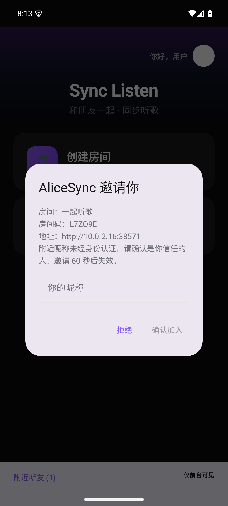
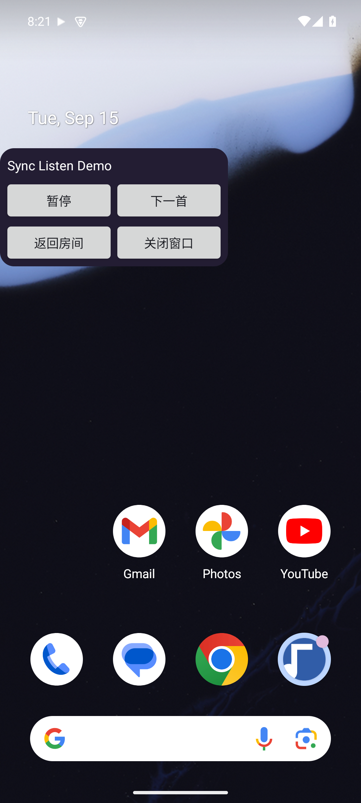
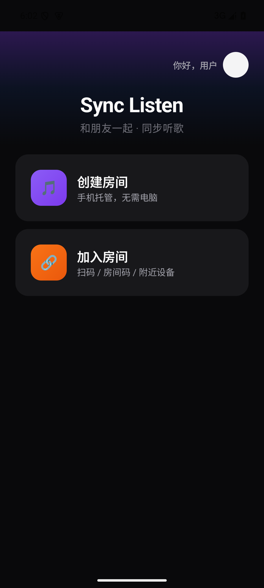
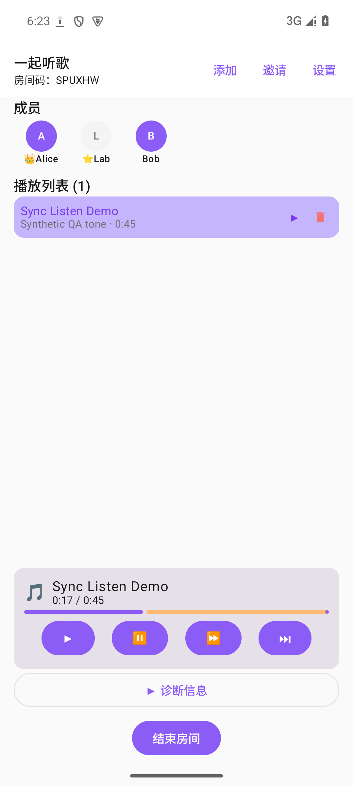
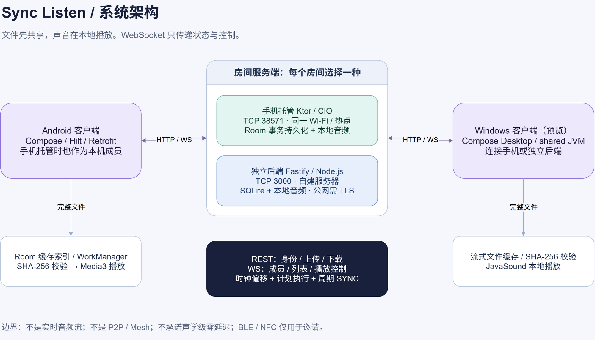

<div align="center">

# Sync Listen
### 同一份音乐，一起按下播放

用一台 Android 手机托管房间，让朋友的设备同步播放本地歌曲。<br/>
不要求电脑在场，不接入音乐账号，不转播实时音频。

[下载 Android / Windows](https://github.com/qiaodogbear/sync-listen/releases/tag/v0.3.0) · [使用指南](docs/getting-started.md) · [问题反馈](https://github.com/qiaodogbear/sync-listen/issues) · [架构与审查](docs/review-2026-09-16.md)


[](LICENSE)
[](https://github.com/qiaodogbear/sync-listen/actions/workflows/ci.yml)

</div>

> **v0.3.0 是面向可信局域网的预览版。** 它解决的是朋友之间共享本地歌曲与播放进度的问题，不是商业音乐服务、专业多音箱系统或公网文件服务器。真机后台稳定性、BLE/NFC 和声学同步仍需要进一步验证。

## 开发分支新增内容

**以下功能在 v0.3.0 发布之后实现，旧 Release 不包含。** 新同步检查点、应用内迷你栏、可选后台播放/跨应用悬浮窗，以及前台主动开启的局域网附近听友和邀请确认，详见 [同步与附近交互设计和用法](docs/sync-and-nearby.md)。真机声学偏差与长时后台表现尚待验收，不承诺逐采样同步。验证范围见 [本轮测试记录](docs/sync-nearby-validation.md)。

<table>
  <tr>
    <td align="center"><br/>附近邀请，确认后加入</td>
    <td align="center"><br/>可关闭的播放悬浮窗</td>
  </tr>
</table>

## 为什么做它

一起听本地音乐，往往需要反复发文件、报进度、倒数后各自点击播放；让电脑一直开着当服务器也不方便。

Sync Listen 把这些步骤放进一个房间：房主手机协调歌曲和播放状态，成员自动缓存同一份文件，再在各自设备上播放。上传完成后，播放控制只同步少量状态，不持续传送实时音频。

适合朋友在同一 Wi-Fi 或手机热点内分享自己有权使用的本地音乐。**无需互联网不等于无需网络**：设备之间仍须可以互相访问，房主也必须在线。

## 界面

<table>
  <tr>
    <td align="center"><br/>从创建或加入开始</td>
    <td align="center"><br/>房间、缓存与同步播放</td>
  </tr>
</table>

截图来自本轮 API 35 模拟器运行，演示音频为自行生成的测试音，不代表第三方音乐内容。

## 三步开始

1. **连接同一网络**：两台手机连接同一 Wi-Fi，或一台开启热点，其他设备连入。
2. **创建和加入**：房主点击「创建房间」，填写昵称和房间名称，允许托管通知。成员扫码加入，或填写房主地址与六位房间码。
3. **添加并播放**：在房间点击「添加」，选择本地音频。等待设备显示缓存就绪，再由房主选择歌曲播放。

手机托管使用 TCP `38571`。普通用户无需安装 Node.js、配置数据库或准备电脑。二维码中的地址必须是其他设备可达的局域网地址，不能用 `127.0.0.1`。

## 已有能力

| 能力 | 当前实现 |
|---|---|
| 手机独立托管 | Android 内置 Ktor 服务，房间状态保存在本机 |
| Windows 一起听 | 独立桌面客户端，连接手机房主或 Node 后端 |
| 房间与权限 | 临时昵称，Host / Admin / Member；服务端校验控制权限 |
| 文件共享 | 流式上传、SHA-256 去重、自动下载、长度与 hash 校验 |
| 同步控制 | 播放、暂停、seek、下一首；服务器时钟、计划执行、周期纠偏 |
| 本地播放 | Android 使用 Media3；桌面使用 Java Sound |
| 重新连接 | WebSocket 重试并恢复权威快照；有缓存时短时断线继续播放 |
| 托管恢复 | 房主异常退出后再次打开，可恢复原房间并以暂停状态继续 |
| 多种邀请 | 房间码、二维码与深链；BLE/NFC 邀请入口已实现，真机待补验 |

**格式说明**：Android 建议先使用 MP3 / FLAC / WAV；其他容器和编码组合以设备解码器为准。Windows 本轮验证了 PCM WAV，集成了 MP3 解码支持但未完成广泛格式验证。文件可上传不等于每个平台都能解码。

## 下载与升级

| 平台 | 文件 | 使用方式 |
|---|---|---|
| Android 8.0+ | `SyncListen-v0.3.0-android.apk` | 在手机安装，按系统提示允许来自所用文件管理器或浏览器的安装 |
| Windows x64 | `SyncListen-v0.3.0-windows-x64.zip` | 解压整个文件夹后运行 `SyncListen.exe`，内含 Java 运行时 |
| 校验文件 | `SHA256SUMS.txt` | 用 SHA-256 核对下载文件 |

从 [v0.3.0 Release](https://github.com/qiaodogbear/sync-listen/releases/tag/v0.3.0) 获取文件。Windows 包尚未配置 Authenticode 签名，系统可能提示未知发布者；请核对来源和校验值，不要关闭系统安全防护。

本版引入设备凭据协议，**不兼容旧版无鉴权房间**，请所有设备一起升级并重新创建房间。旧 Debug 包与正式包使用不同 applicationId，可以并存；若此前安装过同包名、不同签名的测试包，需要先备份所需音频再卸载旧包。

## 架构



```text
android-app/    Android UI、客户端、本地播放、持久化手机服务器
backend/        可选 Node.js / Fastify / SQLite 服务器
shared/         桌面使用的 Kotlin 协议、网络、同步与内存服务端
protocol/       Android 与 shared 共用的设备凭据和校时纯算法
desktop/        Compose Desktop、文件缓存与 Java Sound 播放
docs/           使用、协议、调试、审查和测试证据
scripts/        签名构建与审查文件清单
TASKS.md        唯一进度清单
EXECUTION_LOG.md 轻量恢复日志
```

Android 与 shared 尚未完全合并；目前提取了身份凭据及校时算法公共逻辑。详细职责、技术债及后续拆分见 [架构文档](docs/architecture.md)。

## 本地开发

需要 Node.js 22.13+（本轮使用 24）、完整 JDK 21、Android SDK 35。Windows 中文路径建议映射到空闲 ASCII 盘符。工具位置、模拟器创建、安装、调试和签名命令见 [开发与调试指南](docs/debugging.md)。

```powershell
# 可选的电脑后端
cd backend
npm ci
npm run dev
# 另一个终端：http://127.0.0.1:3000/health
```

```powershell
# Android 独立构建
cd android-app
.\gradlew.bat testDebugUnitTest lintDebug assembleDebug --no-daemon
```

```powershell
# 根目录构建桌面客户端；须使用带 jpackage 的完整 JDK 21
.\gradlew.bat :shared:test :desktop:test :desktop:createDistributable --no-daemon
```

## 质量与边界

本轮按八个模块分块审查，修复了身份冒用、角色权限遗漏、重排冲突、恢复一致性、取消传播、重复上传、桌面自动播放和释放后无法再次使用等问题。新增后端、共享模块和桌面回归测试，并建立三端 CI。

- [审查报告与改进记录](docs/review-2026-09-16.md)
- [测试报告：自动测试与实际模拟运行分开记录](docs/test-report.md)
- [工程审查看板](outputs/review-2026-09-16/SyncListen-Review.xlsx)
- [已知问题与下一阶段优化](docs/known-issues.md)
- [REST API](docs/api.md) / [WebSocket](docs/websocket.md)

当前不支持主机迁移、完全无网络组网、Mesh、实时音频转播、iOS 或第三方音乐 App 音频捕获。蓝牙音箱、耳机和不同声卡输出延迟会影响听感，软件位置接近不代表声学输出精确同步。

## 参与与许可

欢迎提交包含平台、版本、复现步骤和脱敏日志的 Issue。请勿上传设备密钥、房间邀请令牌或无权分发的音乐。

本项目自有代码采用 [MIT 许可证](LICENSE)。第三方组件保留各自许可证，详见 [第三方组件说明](THIRD_PARTY_NOTICES.md)。安全边界与漏洞报告方式见 [SECURITY.md](SECURITY.md)。
