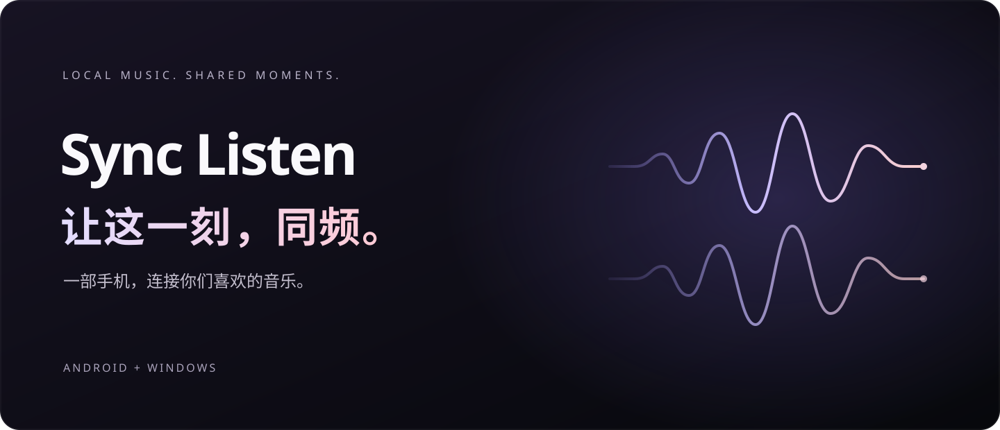

<div align="center">

# Sync Listen

### 让这一刻，同频。

一部手机，连接你们喜欢的音乐。<br/>
和身边的人，共享本地歌曲，也共享播放的节奏。

[下载 Android](https://github.com/qiaodogbear/sync-listen/releases/download/v0.3.0/SyncListen-v0.3.0-android.apk) · [下载 Windows](https://github.com/qiaodogbear/sync-listen/releases/download/v0.3.0/SyncListen-v0.3.0-windows-x64.zip) · [开始一起听](docs/getting-started.md)




[](LICENSE)
[](https://github.com/qiaodogbear/sync-listen/actions/workflows/ci.yml)

</div>

> 当前公开下载为 **v0.3.0 Preview**，面向互通、可信的 Wi-Fi 或手机热点。下文主体验以这个版本为准；标注“开发预览”的功能尚未包含在下载包中。

<br/>

## 有些歌，适合发给朋友。<br/>有些时刻，值得一起听。

朋友就在身边，一首歌也已经选好。

但要一起开始，往往还得先传文件、对进度，再来一句：“三、二、一，播放。”歌暂停了，要重新对齐；换了一首，又得再来一次。

Sync Listen 从一个简单的念头出发：**一起听歌，不应该先把电脑搬来。**

所以，我们把房间放进了手机。一个人创建，朋友加入；歌曲在房间里分享，播放由同一处协调。少一点围着设备忙碌，多一点留给音乐和身边的人。

<br/>

## 你的手机，就是这场一起听的中心。

无需让电脑一直开着。创建房间的 Android 手机，本身就承担歌曲存储、成员连接与播放协调。

朋友可以用另一部 Android 手机加入，也可以让 Windows 电脑成为收听的一端。临时昵称就能开始，不必先建立音乐账号。

**房间由你开启，音乐由你们带来。** 它不提供曲库，也不替你决定下一首该听什么。

<table>
  <tr>
    <td align="center"><br/><strong>从一个房间开始。</strong><br/>手机独立托管，无需电脑。</td>
    <td align="center"><br/><strong>把大家放在同一首歌里。</strong><br/>成员、歌曲与播放状态，在一处看见。</td>
  </tr>
</table>

<sub>真实界面截图，来自 API 35 模拟器。演示音频为自行生成的测试音；顶部封面为品牌图形，不是性能测量。</sub>

<br/>

## 共享的不只是歌单。<br/>还有播放的进度。

每个人都可以把自己有权分享的本地音频添加进房间。成员设备自动下载并校验文件，不必再从聊天记录里逐个保存。

房主与管理员负责播放、暂停、拖动和下一首；普通成员可以贡献歌曲、加入收听。一次操作，由房间传递给大家，而不是靠口头报秒数。

遇到短时断连，**已经缓存的歌曲可以继续在本机播放**。连接恢复后，再接收房间状态并重新跟上。房主异常退出时，重新打开可主动恢复原房间，先停在保存的位置，再决定何时继续。

这不是把连接问题变没了，而是尽量不让每一次连接波动，都打断你正在听的歌。

<br/>

## 文件先到达。<br/>播放，再围绕同一条时间线。

Sync Listen 不把一台手机的声音实时转播到其他设备。它选择了一条更适合共享本地音乐的路径。

**把歌曲带进房间。**<br/>
文件上传到房主；SHA-256 指纹用于识别重复内容，也用于核对文件是否完整。

**让每台设备拥有自己的副本。**<br/>
成员下载并缓存歌曲，再交给本地播放器解码。播放不依赖持续传送整段音频流，仍需要网络传递房间控制与状态。

**让控制拥有共同的时间参照。**<br/>
客户端估算与服务器的时间偏移，按照计划时刻执行播放，并持续接收状态、修正位置偏差。音乐在各自设备上播放，控制围绕同一条时间线展开。

Android 使用 Media3 播放，手机内置 Ktor 协调服务；Windows 使用独立桌面客户端。需要独立部署时，也保留了 Node.js / Fastify 后端。复杂的实现留在工程里，日常使用从“创建房间”开始。

[深入了解架构](docs/architecture.md) · [查看同步机制](docs/websocket.md)

<br/>

## 给相聚的日常，添一条共同的旋律。

### 一张桌子，各自的事情。

有人整理照片，有人做手工，有人只是想安静坐一会儿。把喜欢的歌放进同一个房间，各自戴上耳机，也能共享此刻的歌单和播放节奏。

### 一次见面，每个人都带来一首歌。

不用把选歌这件事交给一个人。朋友加入房间，添加各自收藏的本地音频，再由房主或管理员照顾播放顺序。分享从“这首你听过吗”，变成一段共同的收听时间。

### 一段旅途，不必等外网回来。

出发前安装好应用、准备好本地音乐。歇脚时，一部手机开启热点，其他设备连入；在互通的局域网里创建房间，不要求互联网一直在线。

**这些体验需要设备处于同一互通网络。** 它不是跨城市的云端一起听服务，也不是专业多音箱系统。多人外放时，不同设备的声音仍可能有可闻偏差；请只分享自己有权使用和分发的内容。

<br/>

## 把下一首歌，变成你们的第一首。

### 01 · 先连接彼此。

在各自设备上安装应用，连接同一 Wi-Fi，或让朋友连到房主的手机热点。不需要先安装服务器软件，也不需要配置数据库。

### 02 · 开一个房间，留一个位置。

房主点击「创建房间」，填好昵称与房间名。朋友从「加入房间」扫描邀请二维码，或填写房主地址与六位房间码。二维码会带上连接所需的信息，不必逐字抄写地址。

### 03 · 放进喜欢的歌，一起开始。

点击「添加」，选择本地音频。**先等成员设备缓存就绪**，再由房主选歌、播放。后续暂停、拖动与切歌，都在房间里完成。

当前没有“全部成员自动就绪再开播”的门槛；慢设备尚未下载完成时，可能晚加入播放。Windows 加入需要填写手机房主地址和房间码，桌面端当前不提供独立托管入口。

[完整使用指南](docs/getting-started.md) · [网络与连接排查](docs/debugging.md)

<br/>

## 同步的体验，也要有验证的依据。

v0.3.0 发布前，已经在两台 Android 模拟器上完成手机托管、加入、上传、自动缓存、同步控制与中断恢复的实际流程。不是只有一张概念图，也不只是一次成功构建。

| 已经验证的环节 | 观察到的结果 |
|---|---|
| 同一份文件到达两端 | 自动缓存完成；下载内容通过 SHA-256 校验 |
| 暂停与定位 | 两端播放器均停在指定的 15 秒位置 |
| 服务短时中断 | 成员继续播放已有缓存；服务恢复后重新连接并接收状态 |
| 房主连续恢复 | 播放列表保留，恢复后处于暂停状态 |
| 发布版自动测试 | 134 项单元/服务集成测试 + 1 项真实 Room 数据库设备测试，共 135 项通过 |

我们不会把这些结果写成“零延迟”。

软件进度接近，不等于扬声器在同一瞬间出声。蓝牙耳机、解码器、声卡和系统调度，都会影响最后听见的声音。真机声学偏差、长时间锁屏和不同热点环境，仍需要进一步测量。

**这是一款可以下载体验、仍在认真打磨的预览产品。** [测试记录](docs/test-report.md)与[已知限制](docs/known-issues.md)都公开可查；测试数量不是代码覆盖率，也不是全部设备兼容性认证。

<br/>

## 下一步，让连接更自然。

> **开发预览：下面这些能力已在开发分支实现，但不在 v0.3.0 下载包中。**

在前台主动开启“附近可见”，发现同一局域网里的听友；看到对方的房间后确认加入，或发送一份需要对方确认的邀请。默认关闭，不自动加入，也不会持续后台搜索。

离开房间页面，应用内迷你栏继续陪伴播放。需要时再开启后台播放服务和跨应用悬浮窗；系统授权由你决定，窗口也随时可以关闭。

同步方面，新实现加入四时间戳校时、单调时钟、提前定位和每 500ms 的本地检查，小误差用速度微调，大误差用定位纠正。目标是减少可以避免的误差，而不是许诺通信延迟消失。

<table>
  <tr>
    <td align="center"><br/><strong>邀请，是一次选择。</strong><br/>确认之后，再进入房间。</td>
    <td align="center"><br/><strong>控制，可以留在手边。</strong><br/>按需开启，不必一直停在 App 里。</td>
  </tr>
</table>

开发分支共 155 项自动测试通过，已完成双模拟器发现、邀请和后台操作验证；这些不是旧发布包的测试数字。更短的启动等待还需要全员就绪协议与自适应调度，尚未实现；当前保留 1500ms 的计划准备余量。

[查看开发预览的设计与用法](docs/sync-and-nearby.md) · [查看验证范围](docs/sync-nearby-validation.md) · [跟进开发进度](TASKS.md)

<br/>

## 从现在，开始一起听。

| 你的设备 | v0.3.0 Preview 下载 | 打开方式 |
|---|---|---|
| Android 8.0 及以上 | [Android APK](https://github.com/qiaodogbear/sync-listen/releases/download/v0.3.0/SyncListen-v0.3.0-android.apk) | 安装后创建或加入房间；按系统提示允许所用浏览器或文件管理器安装 |
| Windows x64 | [Windows ZIP](https://github.com/qiaodogbear/sync-listen/releases/download/v0.3.0/SyncListen-v0.3.0-windows-x64.zip) | 完整解压后运行 `SyncListen.exe`，已包含 Java 运行时 |
| 下载校验 | [SHA256SUMS.txt](https://github.com/qiaodogbear/sync-listen/releases/download/v0.3.0/SHA256SUMS.txt) | 核对 SHA-256，确认文件完整 |

[版本说明与全部附件](https://github.com/qiaodogbear/sync-listen/releases/tag/v0.3.0) · [报告问题](https://github.com/qiaodogbear/sync-listen/issues)

Windows 包尚无 Authenticode 签名，可能显示未知发布者；请核对来源与校验值，不要关闭系统安全防护。Android 建议先用 MP3 / FLAC / WAV，具体解码能力取决于设备；Windows 已验证 PCM WAV，MP3 支持已集成但尚未广泛验证。

<details>
<summary>安装、升级与使用边界</summary>

- 所有设备应使用兼容版本。v0.3.0 不兼容旧版无鉴权房间，请升级后重建房间。
- 正式版与 Debug 包可并存，数据不互通。同包名但签名不同的旧测试包不能覆盖安装，先保留需要的数据再卸载。
- 房间码不是全球地址；手机托管使用房主的局域网 IP 与 TCP 38571。127.0.0.1 不能作为给其他手机的邀请地址。
- 没有互联网可以在局域网中使用；完全没有设备间网络则不行。酒店、校园网与部分热点可能隔离设备。
- 手机房主必须保持运行；当前没有主机迁移，主动结束的房间不提供恢复。
- 当前使用明文 HTTP / WebSocket 与设备凭据，适用于可信局域网。不要直接将服务暴露到公网。
- BLE/NFC 邀请入口已实现，但真机验证仍待补充；它们不传输音乐，不能替代局域网。
- 不支持 iOS、Mesh、实时音频转播、第三方音乐 App 音频捕获或 DRM 绕过；文件可上传不等于所有设备都能解码。

</details>

<br/>

## 音乐属于此刻。<br/>选择，留给你们。

Sync Listen 想做的，不是再造一个音乐平台，而是让你已经拥有、也有权分享的音乐，更容易成为一次相聚的一部分。

歌曲由你们选择，房间由你们开启。项目自有代码采用 [MIT 许可证](LICENSE)，实现与改进过程也向开发者开放。我们希望“一起听”不只是一项功能，而是一件更容易开始的小事。

**选一首你想分享的歌。剩下的，从一个房间开始。**

---

<details>
<summary><strong>为开发者：架构、构建与工程资料</strong></summary>


```text
android-app/     Android 客户端、本地播放与持久化手机服务器
backend/         可选 Node.js / Fastify / SQLite 服务器
shared/          桌面使用的协议、网络、同步与内存服务端
protocol/        Android 与 shared 共用的设备凭据和校时算法
desktop/         Compose Desktop、缓存与 Java Sound 播放
docs/            使用、协议、调试、审查与验证记录
scripts/         签名构建与审查文件清单
TASKS.md         唯一进度清单
EXECUTION_LOG.md  轻量恢复日志
```

Android 与 shared 尚未完全合并，平台持久化各有边界。需要 Node.js 22.13+（本机使用 24）、完整 JDK 21 和 Android SDK 35。精确工具路径、Windows 中文路径处理与模拟器命令见[开发与调试指南](docs/debugging.md)。

```powershell
# 可选电脑后端，在 backend 目录
npm ci
npm run dev

# Android 独立构建，在 android-app 目录
.\gradlew.bat testDebugUnitTest lintDebug assembleDebug --no-daemon

# 桌面构建，在仓库根目录，JDK 须包含 jpackage
.\gradlew.bat :shared:test :desktop:test :desktop:createDistributable --no-daemon
```

[整体架构](docs/architecture.md) · [分块代码审查](docs/review-2026-09-16.md) · [工程审查看板](outputs/review-2026-09-16/SyncListen-Review.xlsx) · [REST API](docs/api.md) · [WebSocket](docs/websocket.md)

</details>

欢迎用平台、版本、复现步骤和脱敏日志帮助我们改进。请勿在 Issue 中上传设备密钥、房间邀请令牌或无权分发的音乐。第三方组件遵循各自许可，详见[第三方组件说明](THIRD_PARTY_NOTICES.md)；安全问题请参照 [SECURITY.md](SECURITY.md)。
