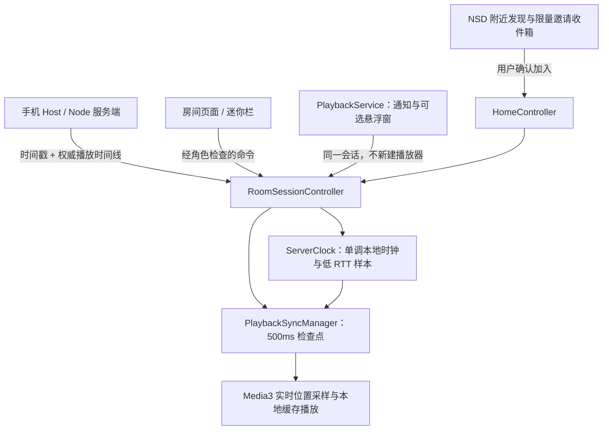

# 同步与附近交互改进

状态：v0.3.0 之后的开发分支功能，不包含在已经发布的 v0.3.0 APK 中。进度只在 TASKS.md 更新；本文件解释设计与使用边界。

## 两个不同的延迟目标

- **控制响应时间**：点击播放到开始出声的等待时间。缩短它需要确保所有在线设备已缓存、解码准备好，并有新鲜的网络时延估计。
- **设备间同步偏差**：同一真实时刻，各设备播放到的位置差。本轮优先减少位置取样陈旧、计划执行和周期纠偏带来的误差。
- RTT 不是单向时延，不能直接把 RTT/2 当作绝对精确的网络传播时间。不同扬声器、声卡、蓝牙编解码缓冲的输出延迟也不包含在 Media3 位置中。

## 实现路径



### 校时

客户端记录发送 t1、接收 t4；服务端增加可选字段 serverReceivedAtMs=t2、serverSentAtMs=t3，同时保留 serverTimeMs=t3 兼容旧客户端。

```text
offset = ((t2 - t1) + (t3 - t4)) / 2
networkRtt = (t4 - t1) - (t3 - t2)
estimatedServerNow = monotonicEpochNow + offset
```

默认连续采样 5 次，单次最多等待 3 秒。忽略逆序、处理时间不合理或超过 10 秒的样本；在最小 RTT + 5ms 的样本集合取 offset 中位数。界面显示 RTT、offset、不确定度估计和样本状态。不确定度含半 RTT、样本离散度及随时间增长的漂移余量，它不是精度认证。

Android 使用 elapsedRealtime 锚定进程启动时的 epoch；桌面使用 nanoTime。用户调整本机系统时间不会直接改变已建立的本地计时速度。90 秒无有效校时视为过期，暂停自动纠偏；没有校准时不盲目执行计划播放。服务器自身改时、睡眠唤醒、输出设备切换仍需实测。

### 计划执行与定点检查

1. 收到新播放计划后，提前准备文件和 seek。若原曲正在播放，先暂停；到达统一时间只发出 play。
2. 指令已经晚到，或等待唤醒迟到超过 40ms，按权威时间线计算目标位置后追赶。
3. 使用曲目 ID、计划时刻和起始位置识别同一计划，周期检查不会重复执行 seek/play 计划。
4. 每 500ms 做一次本地检查，继续接收服务端周期 SYNC；无需每次检查都增加网络请求。
5. Android 在播放器主线程直接采样 currentPosition，避免把 UI 每 250ms 刷新的旧值误当当前值。桌面读取实际已输出帧计数。
6. 校时有效且状态新鲜时，误差超过 max(40ms, 2 × 时钟不确定度) 进入比例速度微调；回到 max(20ms, 2 × 不确定度) 以内恢复正常速度。
7. 速度使用 1 + error/5000，限制在 0.98–1.02。超过 300ms 的偏差进行 seek，同步 seek 之间至少间隔 2 秒，避免反复跳动。用户明确的 seek/切歌不受这个纠偏冷却限制。
8. 不确定度超过 150ms、权威状态超过 15 秒未更新、校时过期或 WebSocket 断开，恢复 1.0 倍速，停止跟随陈旧时间线，但不停止已有本地播放。
9. 桌面不做播放速度调整，使用带冷却的定位纠偏。软件诊断值不能替代声学测量。
10. 断线增加连接代数，作废旧连接正在等待的播放计划；快速重连也不能让旧计划复活。面板保留最近采样而非实时声学误差，失联标记样本过期。当前进度和检查点的取样时刻不同，不应直接相减。

当前仍保留服务器默认 **1500ms** 统一启动提前量。它是准备和送达的安全余量，不是音频流网络缓冲。直接改成 0ms 会让各设备按消息到达先后播放，通常更不同步。

### 后续降低控制等待的方法

下一阶段应增加 PREPARE → READY → COMMIT 两阶段准备协议：服务端分配不可复用的命令序号，各在线成员报告文件 hash、解码状态、校时质量和接收 RTT。所有成员就绪或明确超时策略后，再统一提交。

可实验使用 max(各成员新鲜 RTT 的高分位数 + 解码/调度预算 + 不确定度余量) 计算提前量，并设置上下界。成员采样缺失、网络劣化或未就绪时回退保守值；不要只用房主自己的 RTT 调小所有成员的提前量。这部分尚未实现，必须先补真机测量再选参数。

## 使用新增入口

### 应用内迷你栏、后台播放与跨应用悬浮窗

- 入房后，底部迷你栏显示当前曲目/房间。点击可返回房间，切到上传、邀请、设置页面不再释放播放会话。
- 点击“小窗/后台” → “开启后台播放”，启动 mediaPlayback 类型前台服务，通知可返回、播放/暂停、下一首和离房。
- Android 13+ 会请求通知权限；拒绝不等于系统禁止前台服务，但通知栏可能不显示控制按钮。
- 点击“开启跨应用悬浮窗”，在系统页面自行允许；返回 App 后再次点击开启。授权本身不会自动弹出窗口。
- 拖动窗口标题可移动；“关闭窗口”只关闭窗口。“关闭后台服务和悬浮窗”不会离房，之后长时间后台运行不再受前台服务保护。
- Host/Admin 可以控制播放；Member 的控制按钮禁用，服务和服务端也进行权限检查，不能通过通知/悬浮窗绕过。
- 显式离房时停止会话，释放播放器、连接和窗口。后台服务不自动重启，也不冒用其他服务类型规避系统限制。
- 本轮是独立 Service + 通知控制，尚未实现完整 MediaSession 外部媒体控制集成。锁屏 2 小时、来电、蓝牙切换和各厂商省电策略仍需要真机验证。

Android 14+ 前台服务要求类型和相应权限；跨应用覆盖窗口需要用户的特殊授权。实现依据：[前台服务类型](https://developer.android.com/develop/background-work/services/fgs/service-types)、[SYSTEM_ALERT_WINDOW 权限](https://developer.android.com/reference/android/Manifest.permission#SYSTEM_ALERT_WINDOW)。

### 附近用户与邀请

1. 两台 Android 设备连接同一互通 Wi-Fi 或热点，打开 App。
2. 点击底部“附近听友”，主动打开“附近可见”。只在本次应用进程中记住开关，重新启动默认关闭。
3. 开启期间前台自动发现同样开启的用户。双方不用输入 IP，也不读取联系人、位置或手机硬件标识。
4. 尚未入房的用户可点击他人房间的“便捷加入”，核对名称、房间码和地址，填写昵称后确认。
5. 已入房的用户可向空闲听友发送“邀请加入”。对方收到确认弹窗，60 秒内确认才会加入；拒绝、过期或已有房间时不会自动切换。
6. App 退到后台时停止广播、发现和邀请收件服务。后台播放可以继续，但不会在其他应用上强制弹出邀请。
7. 路由器隔离、热点策略、IPv6-only 或模拟器 NAT 导致发现失败时，仍用二维码、手动码、原有 BLE/NFC 入口。桌面版暂未加入这一自动发现实现。

使用 Android 官方 [Network Service Discovery](https://developer.android.com/develop/connectivity/wifi/use-nsd)，服务类型为 _synclisten._tcp.，服务端口由系统临时分配。只支持私有/链路本地 IPv4；设备身份是每次启用重新生成的随机会话标识，不广播安装凭据或入房令牌。

NSD TXT 只包含版本、随机 ID 和临时请求 nonce；带 nonce 的 /nearby/profile 提供昵称和可加入房间，/nearby/invite 接收定向邀请。邻居 HTTP 客户端与房间鉴权客户端分离，不向邻居发送设备凭据，不跟随重定向。请求正文最多 4KiB，读取超时 3 秒；最多保留 1 个待处理邀请，5 次/分钟，短期重放去重，发现集合最多 64 项，旧用户列表过期删除。

nonce 不是身份认证，局域网内仍可能有冒名用户。附近昵称和房间名称必须当作不可信信息，用户需要确认自己认识邀请人。该入口不应暴露到公网。服务发现机制也不保证隔着 NAT 的模拟器或所有热点都能互见。

## 验证方法

本轮自动测试与共享 Wi-Fi 模拟器证据见 [同步与便捷性验证记录](sync-nearby-validation.md)。Emulator 36.6.11 的 WiFiPacketStream + AndroidWifi 已完成真正的两机 NSD 发现、邀请确认和直接 LAN 加入；不能据此保证全部真机热点或路由器行为一致。

自动验证命令继续使用 docs/debugging.md。新增用例覆盖四时间戳、低 RTT 过滤、单调时钟、比例控制漂移模拟、重复计划、seek 冷却、断线复位、HTTP 正文上限、nonce、邀请限流/重放/过期；模拟结果不当作真实设备误差。

真机应至少记录：两机同一音频的启动/seek/持续播放输出差 p50/p95/最大值、每机 RTT/校时质量、是否蓝牙输出、路由器模式、失联恢复耗时和耗电。推荐使用左右声道分别接收两台设备输出的录音，或共同节拍音加互相关分析；不要只比较两张屏幕上的毫秒数字。
